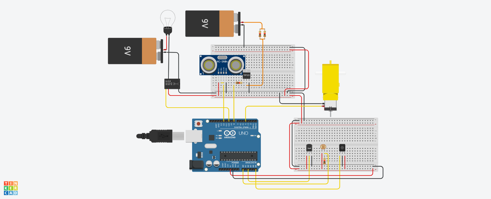

# SPIDS
Smart Plantts IDS project: controling the environment of a plant with an Arduino system

## Visualisation des données
Les données recueillies par les différents capteurs peuvent être visualisées à l'aide d'un dashboard réalisé avec `Node-RED`. Pour cela nous utilisons un flow comme ci-dessous:   

Le résultat dans le cas de l'humidité est le suivant:    

## Notifications
Un système de notifications automatisés est implémenté sur `Node-RED`. Il permet d'informer en temps réel l'utilisateur des variations de l'environnement de sa plante via sa messagerie électronique. 
    

## Circuits
Les capteurs soint à brancher comme ceci :

Voici un schéma du montage : 

n.b.: le capteur d'hygrométrie n'étant pas disponible sur le logiciel de visualisation, nous l'avons remplacé par un capteur infrarouge (3 pins, un cercle au milieu)

## Circuits

Pour commander les actionneurs reliés à la carte `Arduino Uno` depuis la carrte `RaspberryPi` un système de messages codés est utilisé. Chaque message est composé de 6 chiffres, les deux premiers permettent d'identifier la commande et les 4 suivants la valeur associée. Par exemple: `"010018"` a pour code "01" ce qui permet dde régler la température minimale et la valeur est "0018" ce qui correspond à 18°C. 

| Commande               | Code | Info  |
|------------------------|------|-------|
| Température minimale   | 01   |transparent	|
| Température maximale   | 02   |transparent	|
| Luminosité minimale    | 03   |transparent	|
| Luminosité maximale    | 04   |transparent	|
| Actionner la pompe     | 05   |transparent	|
| Actionner le chauffage | 06   |transparent	|
| Humidité minimale      | 07   |transparent	|
| Changer mode pompe     | 08   |0000 if full manual, 0001 if hygrometric, 0002 if cyclic	|
| Changer mode chauffage | 09   ||
| Changer période pompe  | 10   |new period in hours |

