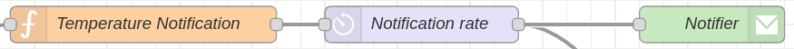

# SPIDS
Smart Plantts IDS project: controling the environment of a plant with an Arduino system

## Visualisation des données
Les données recueillies par les différents capteurs peuvent être visualisées à l'aide d'un dashboard réalisé avec `Node-RED`. Pour cela nous utilisons un flow comme ci-dessous:   

Le résultat dans le cas de l'humidité est le suivant:    

## Notifications
Un système de notifications automatisés est implémenté sur `Node-RED`. Il permet d'informer en temps réel l'utilisateur des variations de l'environnement de sa plante via sa messagerie électronique. 
    

## Circuits
Les capteurs soint à brancher comme ceci :

